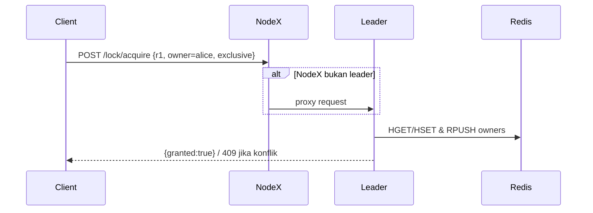
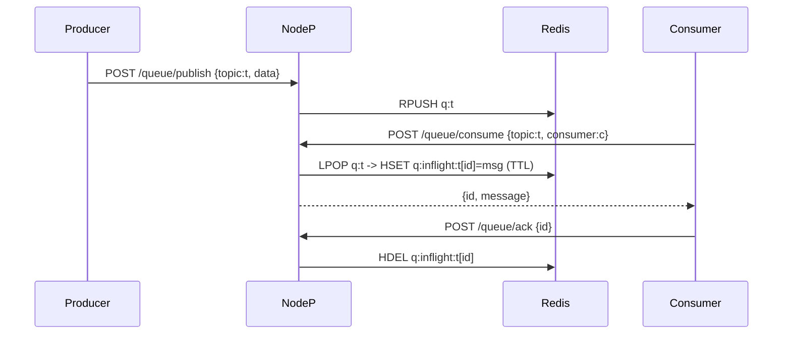
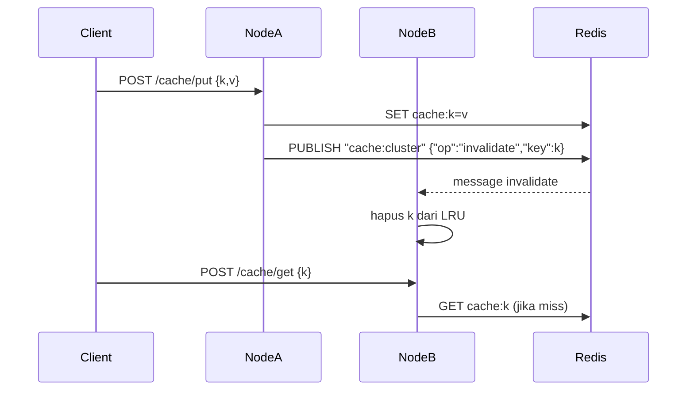

# Architecture — Distributed Sync System

Sistem terdiri dari **tiga node HTTP** berbasis Python (aiohttp) dan satu **Redis**. Tiap node berisi:
- **RaftNode** — pemilihan *leader* dan koordinasi.
- **LockManager** — kunci **exclusive/shared** untuk sumber daya.
- **QueueNode** — antrian pesan dengan **consistent hashing**, persistence di Redis, dan **ACK** (*at-least-once*).
- **CacheNode** — cache LRU in-memory + sumber kebenaran di Redis; **invalidasi** via Redis **pub/sub**.

Klien dapat memanggil node mana pun. Jika permintaan harus diputuskan leader, node akan **mem-proxy** ke leader sehingga klien tidak perlu mengetahui siapa leader aktif.

## Diagram Komponen (ASCII)

```
[Client] → HTTP
   │
 ┌─▼──────────┐   ┌───────────────┐
 │ Node 1     │   │               │
 │ Raft/Lock  │──▶│               │
 │ Queue/Cache│   │     Redis     │  (state, list queue, pub/sub)
 └─▲──────────┘   │               │
   │              └───────────────┘
 ┌─▼──────────┐
 │ Node 2     │   (semua node expose /lock, /queue, /cache, /raft)
 └─▲──────────┘
   │
 ┌─▼──────────┐
 │ Node 3     │
 └────────────┘
```

> Redis menyimpan: state lock, list antrian, in-flight, nilai cache, dan kanal pub/sub untuk invalidasi.

## Alur Kunci: Acquire Lock (exclusive)


## Alur Antrian: Publish → Consume → ACK


## Alur Cache: Put → Invalidate → Get


## Konsistensi & Keandalan
- **Lock**: keputusan oleh leader → mencegah *split-brain*; konflik → HTTP 409.
- **Queue**: **at-least-once** melalui in-flight + ACK; pesan dapat diambil ulang jika tidak di-ACK (TTL).
- **Cache**: *invalidate on write* agar node lain tidak melayani data basi.
- **Observability**: `/metrics`, `/health`, `/raft/state`.

## Batasan & Pengembangan
- Raft saat ini fokus **election/heartbeat** dan replikasi entry sederhana.
- Deteksi deadlock masih minimal (belum wait-for graph penuh).
- Untuk skala lebih besar: **Redis cluster/sharding**, orchestration **Kubernetes**, serta **chaos testing**.

## Rujukan
- Kode: `src/nodes/*`, `src/consensus/raft.py`
- API spec: `docs/api_spec.yaml`
- Compose: `docker/docker-compose.yml`
